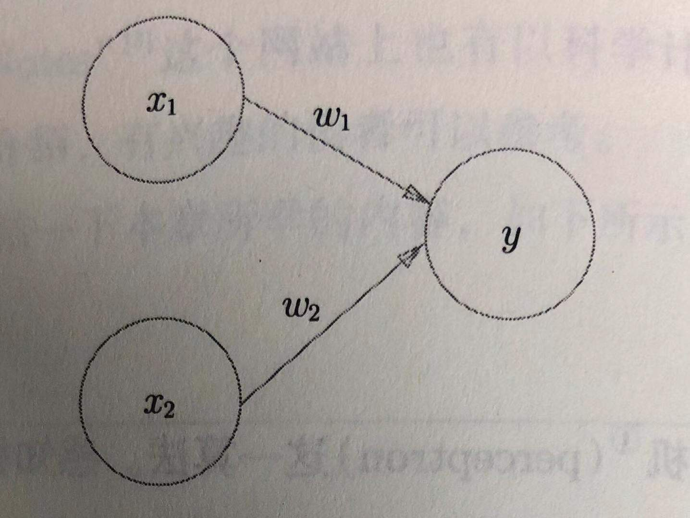
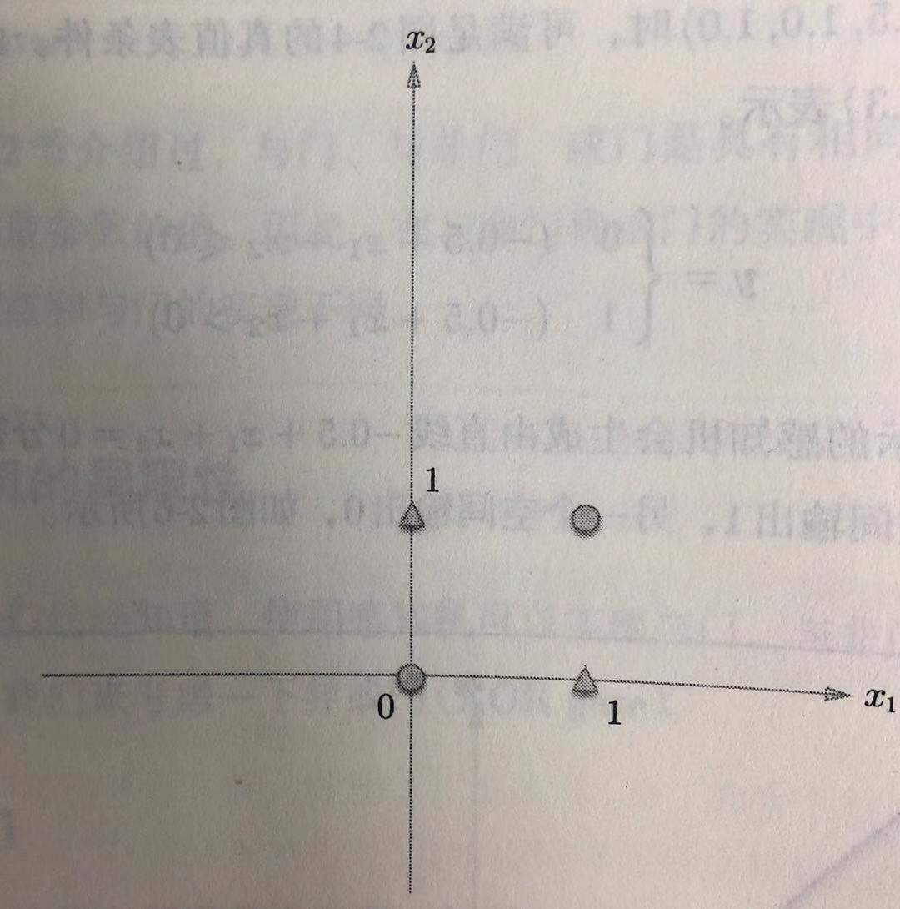
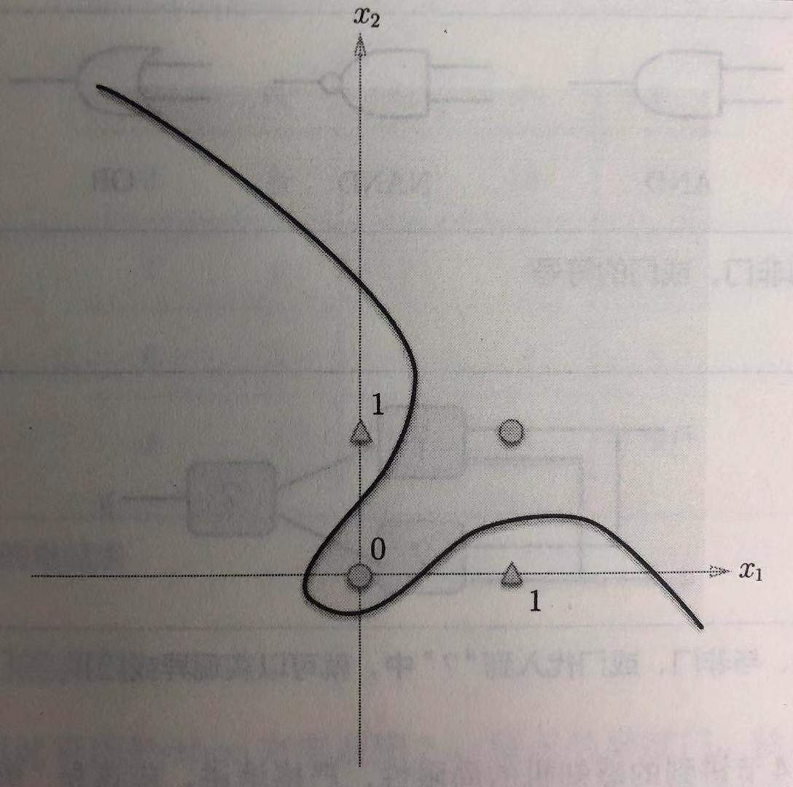
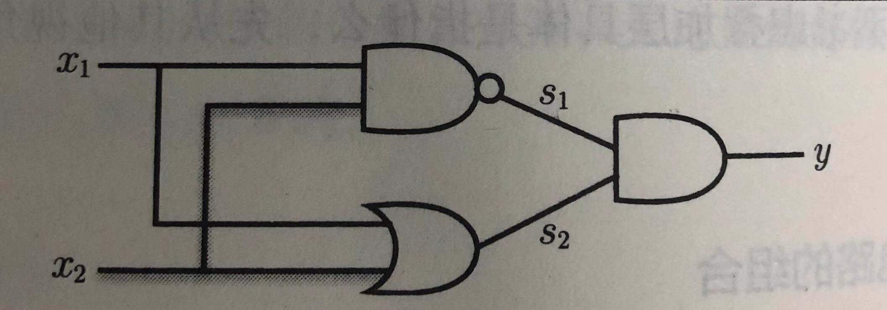
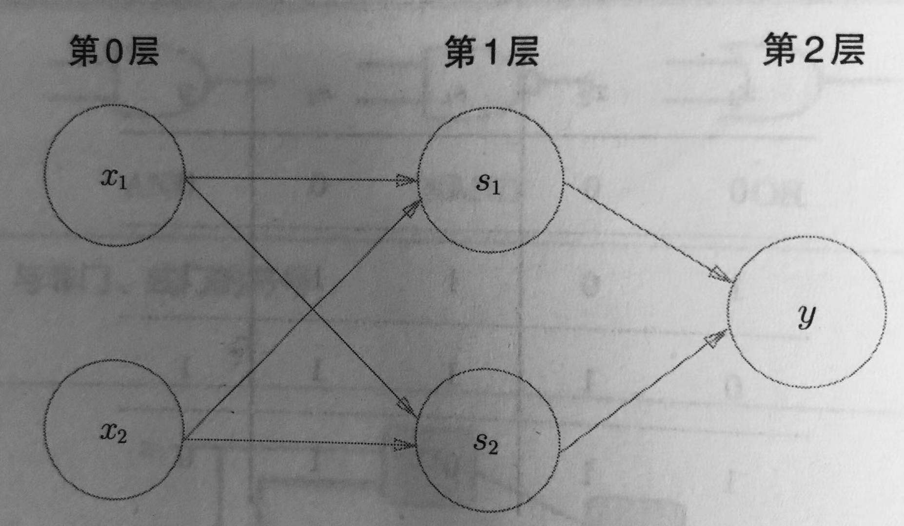

**感知机（perceptron）** 算法由美国学者Frank Rosenblatt在1957年提出。感知机是神经网络的起源算法，因此，要想学习机器学习，了解感知机的重要思想是非常必要的。

## 1.感知机是什么
感知机就是接收多个输入信号，给出一个输出信号的模型。
如图，是一个有两个输入，一个输出的最基本的感知机。图中圆圈为神经元，当两个输入乘以对应的权重并加和进入该神经元后，如果值大于设定的阈值 $\theta$ ，则该神经云被激活，输出1，否则输出0，阈值用 $\theta$ 表示。



<center>图1 有两个输入的感知机</center>数学式表示如下：
公式1 

$$
y=\left\{
\begin{aligned}
0 \quad(\omega_1x_1 + \omega_2x_2 \leq \theta) \\
1 \quad(\omega_1x_1 + \omega_2x_2 > \theta) \\
\end{aligned}
\right.
$$

## 2.简单逻辑电路
感知机可以表示基本电路如与门电路表如下：

<center>表1 与门真值表</center>

|x1|x2|y|
|-|-|-|
|0|0|0|
|1|0|0|
|0|1|0|
|1|1|1|

如何用感知机表示呢？很简单，只需要人工设定好一定的权值，即可得到，如权值 $\omega$ 设为：(0.5,0.5,0.7),(1.0,1.0,1.0)等都可满足。

同样的，或门与非门也可以通过设定不同的参数，使用感知机进行表示。
这里参数是通过人工设定的，而机器学习的目的就是通过训练数据让计算机找到正确的参数，该过程就叫做**学习**。

## 3.感知机的实现
为了更加数学化的表示以上实现过程，作如下改变：
公式2

$$
y=\left\{
\begin{aligned}
0 \quad(b + \omega_1x_1 + \omega_2x_2 \leq 0) \\
1 \quad(b + \omega_1x_1 + \omega_2x_2 > 0) \\
\end{aligned}
\right.
$$

此处，b为偏置， $\omega​$ 为权重。权重表示了控制输入信号的重要性，偏置则是激活神经元的容易程度。
实现形式如下：

```python
def AND(x1, x2):
	x = np.array([x1, x2])
	w = np.array([0.5, 0.5])
	b = -0.7
	tmp = np.sum(w*x) + b
	if tmp <= 0:
		return 0
	else:
		return 1
```

## 4.感知机的局限
如下，异或逻辑电路的真值表如下

<center>表2 异或门真值表</center>

|x1|x2|y|
|-|-|-|
|0|0|0|
|1|0|1|
|0|1|1|
|1|1|0|

发现无论如何对感知机调参，感知机都无法实现异或逻辑电路的表示。



<center>图2 可否通过一条直线分开圆形和三角</center>



<center>图3 使用曲线可以分开圆形和三角</center>

所以，感知机只能表示由一条直线分割的空间，即线性空间，不能表示非线性空间。

## 5.多层感知机
不用悲观的是，如下图所示，我们通过之前实现的多个感知机，就可以实现异或逻辑的表示。如图，多层感知机就是一个多层的神经网络结构。

 

<center>图4 通过组合与、与非、或门实现异或门</center> 



<center>图5 用感知机表示异或门</center>

<center>表3 异或门真值表</center>

|x1|x2|s1|s2|y|
|-|-|-|-|-|
|0|0|1|0|0|
|1|0|1|1|1|
|0|1|1|1|1|
|1|1|0|0|0|

理所当然，异或门的实现也相当简单，按照组合逻辑调用之前的门函数即可：

```python
def XOR(x1, x2):
	s1 = NAND(x1, x2)
	s2 = OR(x1, x2)
	y = AND(s1, s2)
	return y
```

理论证明，通过组合多层感知机可以表示任意电路，甚至可以表示计算机。其实，理论上2层就够表示计算机，即现实现与门和或门，然后实现全加器和半加器，接着实现算数逻辑单元ALU，最后实现CPU。
